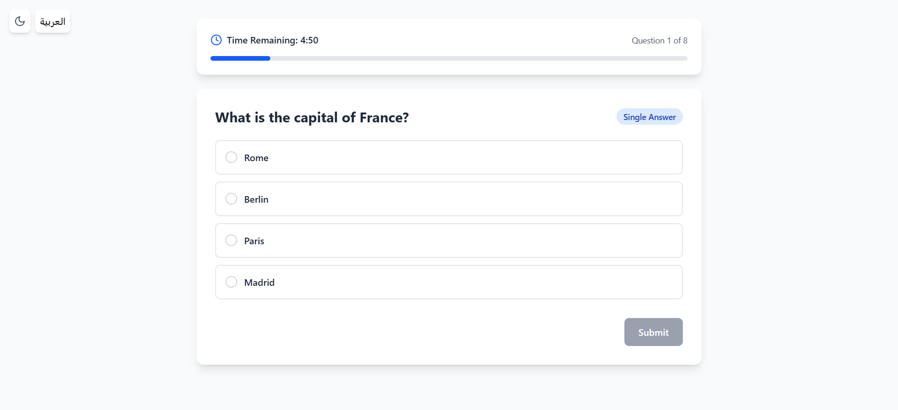

# Vue.js Quiz App with Pinia & TypeScript



## The process of task

- Created the vue 3 project from vite cli
- Installed all the dependencies
- installed vue-i18n & pinia & taiwlind to establish the project
- Used V0.dev and Bolt for tha first boilerblate of the task
- took the output and choose the best of them
- Started to work on the task and added enhancments
- The task was completed in 5 hours

## Overview

A feature-rich quiz application built with:

- Vue 3 Composition API
- Pinia (state management)
- TypeScript
- Animated transitions
- Responsive design

## ✨ Features

### Quiz Functionality

- Single & multiple answer questions
- 5-minute timed quiz
- Real-time answer feedback
- Score calculation
- Results export (JSON)

### UI/UX

- Dark/light mode toggle
- Smooth animations
- Confetti celebration
- Progress tracking
- Keyboard navigation

## 🛠️ Installation

```bash
cd vue-quiz-app
npm install
npm run dev
```
